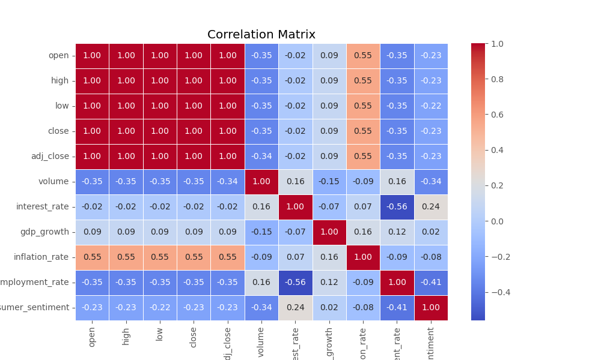

# Stock Price Prediction Using a Recurrent Neural Network
Author: Elijah Lopez

`Disclaimer`: The results of this project and any 'recommendations' or insights provided herein are for educational and informational purposes only. They do not constitute financial advice or recommendations. Please consult a qualified financial advisor before making any investment decisions. The author is not responsible for any financial losses or consequences resulting from the use of this information.

## Overview
Invesco QQQ Trust (QQQ) is an exchange-traded fund that tracks the Nasdaq-100 Index, a technology-focused index. It seeks to match the performance while maintaining a low expense ratio. This analysis investigates the performance of QQQ over time. To quantify its performance I calculated the compounded annual growth rate as well as median and mean monthly perforance for trading days between January 1, 2000 - December 31, 2023. While results vary in magnitude, both median and mean monthly performance support positive investment returns for most months of the year with the strongest growth occuring in October. One of the challenges faced was the multicollinearity of the stock data, which impacted modeling and interpretation of results. This analysis provides insights into stock market trends, although more research is needed to uncover other factors that influence stock price.

## Business Problem
Retail investors often face challenges in making informed investment decisions, especially when navigating volatile stock markets. While financial experts and institutional investors may have access to sophisticated tools and strategies, individual retail investors typically lack resources and insights to effectively analyze stock trends and performance.

The objective of this project is to address these challenges by identifying observable trends in the stock market, specifically focusing on performance metrics such as Compound Annual Growth Rate (CAGR), monthly performance (median and mean), and other relevant data points. By analyzing and visualizing these trends, the goal is to provide actionable insights that can help retail investors make more informed decisions.

## Data
QQQ stock data was obtained from [Yahoo Finance](https://finance.yahoo.com/) and economic data was obtained from [Federal Reserve Economic Data](https://fred.stlouisfed.org/).
Curated dataset is indexed by 'date' and contains:
* 6,037 samples (trading days) measured on 11 numeric features. These include:
    * Stock features: price at open, high of day, low of day, price at close, adjusted closing price, and daily trading volume
    * Economic features (USA): interest rate, GDP growth, inflation rate, unemployment rate, and consumer sentiment
* Sample range is from Jan. 3, 2000 to Dec. 29, 2023.
* After backfilling values, the dataset contains no null values.

## Methods
### EDA
The main focus of my exploratory analysis was on QQQ performance over time. I quanitfied this in three meaningful ways.
1. Compounded Annual Growth Rate (CAGR)
2. Median monthly performance over the time period
3. Mean monthly performance over the time period

In addition to these I checked for multicollinearity among features and conducted a Kruskal–Wallis statistical test before moving to machine learning.

### Machine Learning
Data preprocessing included:
*  Splitting training and testing data as follows:
    * Train set: Jan. 2000 - Dec. 2018
    * Test set: Jan. 2019 - Dec. 2023
* Applying min-max scaler to each set independently

Classical machine learning models were tested in a 'shotgun' approach to determine baseline performance. Lasso and Random Forest were the top performers. Each of these models was tuned using GridSearchCV to determine best performance.

I then created a Recurrent Neural Network to make long term predictions. I tested Simple RNN, Long Short Term Memory (LSTM), and Gated Recurrent Unit (GRU). Of these, GRU performed the worst. Because LSTM is known to work with more complex datasets, I chose to further develop this model despite Simple RNN performing similarly on baseline assessment. The final LSTM model was developed through iterative trials in which the following hyperparameters were adjusted:
* Timesteps
* Number of layers and types of connections
* Units in each layer
* Use of return sequences
* Kernel regularizers and amounts
* Dropout layers and amounts
* Optimizers with and without momentum

Each iteration was measured on loss (mean squared error) and visualized comparing actual and predicted stock prices on test data.

## Results
### Performance Over Time

* Compounded Annual Growth Rate = 6.29%
* A $1,000 investment on Jan 1, 2000 would be worth over $4,300 at the end of 2023

### Feature Correlations

* Stock price at open, high of day, low of day, close, and adjusted close are all nearly perfectly correlated.

### Monthly Performance

* Median monthly performance shows variations in monthly perofrmance that are not statistically significant.
    * Best month: October
    * Worst month: February

* Mean monthly performance
    * Best month: October
    * Worst month: September

### Machine Learning
#### Lasso

* Lasso classical algorithm worked well to minimize loss while making accure predictions.

#### RNN

* While RNN was expected to ourperform, more architectural work is needed to boost performance.
* Adjusting time horizon of predictions may allow for more accurate predictions.

## Conclusions
This analysis leads to three recommendations:

1. Investing early is integral to long term wealth building as compounding interest will work in your favor.

2. Initializ investments in late September/early October to benefit from the best early returns.

3. Avoid initializing investments in the early parts of February, June, and September.

Currently, the Lasso regression model stands as the most effective model in terms of performance. This model's predictive capabilities enable it to offer valuable insights into future stock price movements, providing a reliable foundation for making informed investment decisions. By leveraging this model, users can forecast potential trends and fluctuations in stock prices, thereby positioning themselves to strategically capitalize on market opportunities and maximize financial returns. However, it is important to consider that, while the model provides significant predictive power, continuous refinement and validation are essential for maintaining accuracy and reliability in a dynamic market environment.

## Next Steps
### For Retail Investors
* Compare QQQ performance to other index ETFs or mutual funds.
* Assess associated risks of investing.
* Speak with a financial professional if seeking to begin investing.

### For Model Improvement
* Utilize technical indicators that help quanitfy variance in stock price movements.
* Incorporate additional macroeconmic data that affects the stock market.
* Shorten the predictive time horizon and use additional recent data for training.

## For More Information
See the full analysis in the [EDA Notebook](eda_notebook.ipynb) and [ML Notebook](machine_learning.ipynb) or review this [presentation](slides.pdf).

For additional info, contact the author at:

Elijah Lopez | elijahlopez94@gmail.com